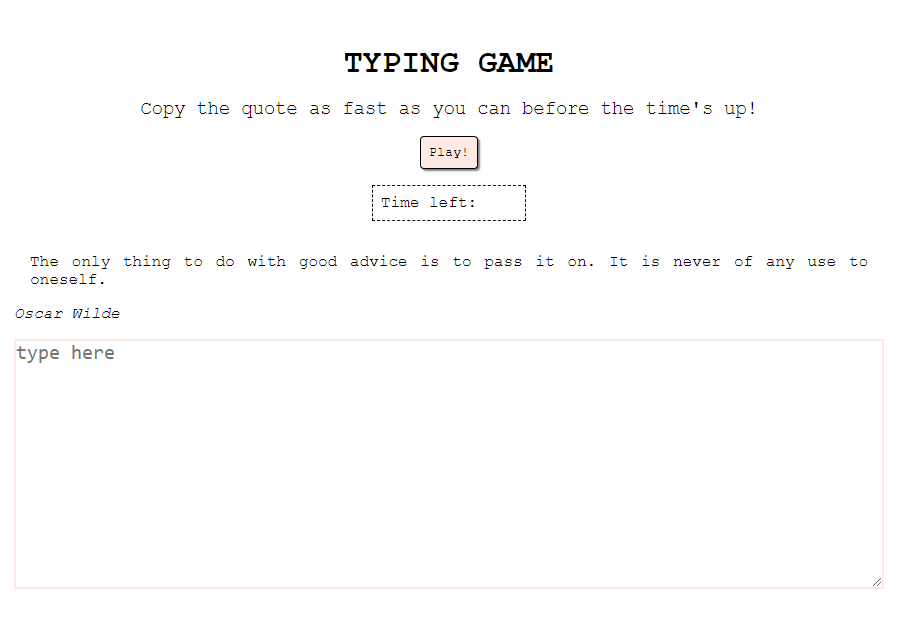

# Typing Game
This is a game where you have to type as fast as you can the quote given. At the end of 10 seconds it gives you your score in percentage, representing the amount of text you typed correctly.

**Link to project:** https://victoria-parker.github.io/typing-game/

## How It's Made:

**Tech used:** HTML, CSS, JavaScript

For this project I used functional javascript in general and promises for fetching the quote. The objective was to keep it as simple an clean as possible.

## Optimizations

I want to add to it a way that the game starts when you start typing instead of when you press play as you might loose a bit of time in between. I would also like to set up a button to play again instead of having to refresh the page. And lastly, I would like to prevent the posibility to copy-pasting into the textarea.

